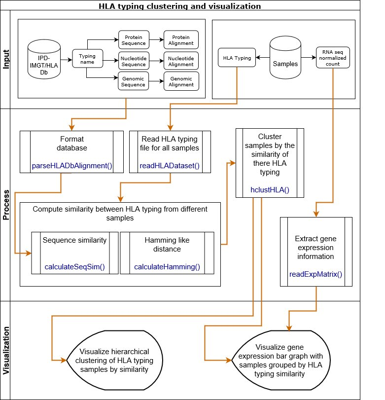

# HLA typing clustering and visualization based on specific similarity metrics #

 

The **HLAClustRView** package implements specialized similarity metrics that
quantify the similarity between HLA typing from multiple samples. Using 
these metrics, the package enables hierarchical cluster analysis and can 
bind RNA-seq expression (when available) to the clusters.

## Description of Package Functionality ##

The vignette of the **HLAClustRView** package, which is a document that 
provides a task-oriented description of the package functionality, contains the 
most up-to-date information.

## Package Workflow ##

## Citing ##

If you use the *HLAClustRView* package 
for a publication, we would ask you to cite the following:

> Nissim Ranade, Santiago Medina, Adewunmi Adelaja, Astrid Deschênes and Pascal Belleau (2018). HLAClustRView: HLA typing clustering and
  visualization based on specific similarity metrics. R package version 0.99.0.

## Authors ##

[Nissim Ranade](https://www.linkedin.com/in/nissim-ranade-4029b3b5 "Nissim Ranade"), Santiago Medina, Adewunmi Adelaja, Astrid Deschênes and 
[Pascal Belleau](http://ca.linkedin.com/in/pascalbelleau "Pascal Belleau")

## License ##

This package and the underlying *HLAClustRView* code are distributed under 
the MIT license. You are free to use and redistribute this software. 

For more information on MIT license see: [https://opensource.org/licenses/MIT](https://opensource.org/licenses/MIT)

## Bugs/Feature requests ##

If you have any bugs or feature requests, 
[let us know](https://github.com/NCBI-Hackathons/Integrating-HLA-typing-methods-and-RNA-seq/issues). 

Thanks!
