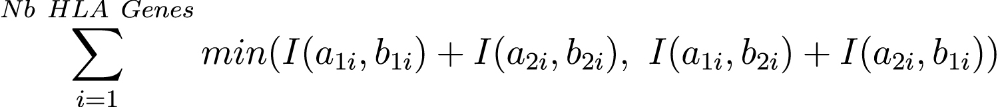
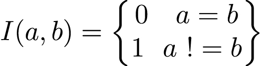
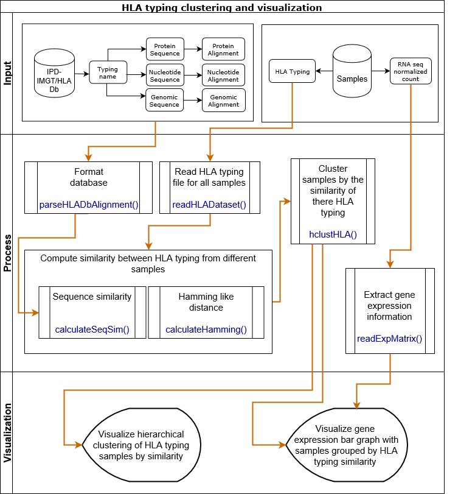

```{r style, echo = FALSE, results = 'asis', warning=FALSE, message=FALSE}
library(knitr)
library(HLAClustRView)
```

<br />


**Package**: `r packageDescription("HLAClustRView")[["Package"]]` <br />
**Authors**: `r packageDescription("HLAClustRView")[["Author"]]` <br />
**Version**: `r packageDescription("HLAClustRView")$Version` <br />
**Compiled date**: `r Sys.Date()` <br />
**License**: `r packageDescription("HLAClustRView")[["License"]]` <br />


# Licensing  #

The *`r packageDescription("HLAClustRView")[["Package"]]`* package and the 
underlying *`r packageDescription("HLAClustRView")[["Package"]]`* code 
are distributed under the MIT license. You are free to use and 
redistribute this software.

# Citing #

If you use the *`r packageDescription("HLAClustRView")[["Package"]]`* package 
for a publication, we would ask you to cite the following:

```{r citation, comment='', echo=T, include=T, message=FALSE, error=FALSE}
citation("HLAClustRView")
```

# Introduction #

The human leukocyte antigen (HLA) complex plays an important biological role in 
the regulation of the immune system. HLA alleles encode major 
histocompatibility complex (MHC) protein, which display peptide antigens for 
recognition by T cells. MHCs are essential for antiviral, antibacterial, and 
anti-tumor immunity [@Kumar2012]. Further, inheritance of specific HLA alleles 
are implicated in autoimmune disorders, such as inflammatory bowel 
disease, type 1 diabetes, rheumatoid 
arthritis, and systemic lupus erythematosus [@Gutierrez-Arcelus2016a]. 
Furthermore, HLA gene products play a critical role in the outcomes of human 
organ transplantation [@Choo2007]. 

The set of genes that form the HLA complex are highly polymorphic and the 
novel alleles are still discovered [@Abraham2018].High polymorphism of 
HLA alleles provides some immunologic advantages against infectious disease, 
it also presents challenges for organ transplantation. 
Successful tissue and organ transplantation requires that donors and 
recipients have compatible HLA alleles[@Kumar2012]. Because of their 
high polymorphic status, accurate typing of HLA genes with short-read 
sequencing data is a challenging task. Software specialized in HLA typing such
as xHLA [@Xie2017] and HLAProfiler [@Buchkovich2017], had to be developped. 

Since 1998, the IMGT/HLA Database [@Robinson2015] has provided curated 
information about polymorphism in the human genes of the immune system.
The naming of HLA genes, allele sequences, and their quality control under the 
responsibility of the [WHO Nomenclature Committee for Factors of the HLA System](http://hla.alleles.org/nomenclature/committee.html).

Having metrics that would capture the degree of affiliation between 
HLA alleles would facilitate association studies and clustering analysis. 
However, establishing those similarity metrics is challenging for a number of
reasons.  First, the number of HLA alleles is very large and second, the 
HLA nomenclature is complex. Only few similarity metrics based on HLA 
nomenclature are currently available. 
As an example, van Dorp and Kesmir have developed a Bayesian method that takes 
functional HLA similarities into account to find HLA
associations with quantitative traits [@VanDorp2018].

The *HLAClustRView* package implements novel metrics that use HLA typing to 
calculate the degree of similarity between HLA molecules. Those metrics has 
been developed to ease the integration of HLA typing nomenclature in complex
analysis. In addition, functionalities enabling cluster analysis
and visualisation of associated RNA expression have been added to the 
*HLAClustRView* package.

# Metrics which estimate similarity between two HLA typing 

To enable quantification of the similarity between two HLA typing, a similarity
metric must be used. The *HLAClustRView* package implements two metrics.

## Hamming distance based on first HLA typing field ##

In information theory, this Hamming distance is broadly applied to quantify 
similarity among data strings. The Hamming distance between two binary strings 
of equivalent length is usually calculated by summing the differing positions 
between the two strings. This Hamming distance has also applications in 
computational biology where is can be used to approximate pattern matching 
between sequences [@Ristov2016].  

We used the first HLA typing field, which designates the allele type based 
on genetic similarity, to define a Hamming-like distance. The metrcic is 
defined as the sum of the minimal differing allele types for each HLA gene. 
As alleles are not phased, all combinaisons between alleles of the two 
samples are tested. The combinaison with the minimal difference is retained 
for the calculation of the metric.

<br>

<center>

{width=75%}

</center>

<br>

<center>

{width=22%}

</center>

where:

* <font size="+1">a~1~ and a~2~ are the two alleles of the first sample for a given gene</font>
* <font size="+1">b~1~ and b~2~ are the two alleles of the second sample for a given gene</font>

## Distance based on sequence similarity ##

TODO

# Workflow #

The *`r packageDescription("HLAClustRView")[["Package"]]`* package is splitted
in 3 main sections: input, process and visualization. The Figure 1 shows the
workflow within each section. 

<center>



</center>


<br>
<br>

# HLA typing input format #

The file containing the HLA typing for multiple samples needs to respect a
specific format.

The general format is:

* The file must have a header.
* The fields in the file must be separated by tabulation.
* Each line should represent a different sample.

The specification for the columns are:

* The first column is the name of the sample and should be named "Sample".
* Following columns come in pairs and represent the 2 alleles for the same gene. For one gene, the name of the 2 columns should be the name of the gene followed by "_1" and "_2". The values of the 2 columns can be interchanged as the alleles are not considered phased.
* The number of columns is not fixed and depend on how many genes has been typed.

This is an example of what the file should look like:

```{r demoDataset, echo=FALSE, message=FALSE, warning=FALSE}
demoData <- data.frame(Sample=c("Sample_1", "Sample_2", "Sample_3", "..."), 
                A_1=c("A*24:02:01:01", "A*01:01:01:20", "A*01:01:03", "..."),
                A_2=c("A*01:01:03", "A*01:01:10", "A*01:01:21", "..."),
                H_1=c("H*01:01:01:03", "H*01:02", "H*01:02", "..."),
                H_2=c("H*02:01:01:01", "H*02:02", "H*01:02", "..."),
                J_1=c("J*01:01:01:03", "J*01:01:01:03", "J*01:01:01:05", "..."),
                J_2=c("J*01:01:01:03", "J*01:01:01:06", "J*02:01", "..."),
                "..."=c(rep("...", 4)))
kable(demoData)
```

<br>

# An analysis step by step #

### 1. Installing HLAClustRView package

The *devtools* package provides *install_github()* that enables installing 
packages from GitHub.

```{r installPackage, warning=FALSE, message=FALSE, eval=FALSE}
library(devtools)
install_github("NCBI-Hackathons/HLAClustRView")
```

### 2. Loading HLAClustRView package

```{r loadingPackage, warning=FALSE, message=FALSE} 
library(HLAClustRView)
```

### 3. Loading HLA typing samples file

The sample file "Samples_HLA_typing.txt" used in this analysis looks 
like this (only the first seven columns and first five rows are shown):

<br>

```{r demoData, echo=FALSE, message=FALSE, warning=FALSE}
demoData <- read.table("./Samples_HLA_typing.txt", header=T, sep="\t")
kable(demoData[1:5, 1:9])
```

<br>

The file containing the HLA typing for multiple samples needs to be loaded. 
This is done by the *readHLADataset()* function. The output is an 
object of class *HLADataset*.

```{r parseSample, warning=FALSE, message=FALSE}
HLAdata <- readHLADataset(hlaFilePath = "./Samples_HLA_typing.txt")
HLAdata
```

### 4. Calculating Hamming-like metric

The Hamming-like distance, which is based on first HLA typing field, can be 
calculated through the *calculateHamming()* function. The output is an object
of class *HLAMetric*.

```{r similarityCalcul, warning=FALSE, message=FALSE}
hammingMetric <- calculateHamming(HLAdata)

print(hammingMetric)
```


### 5. Clustering using Hamming-like metric

```{r clusteringHamming, warning=FALSE, message=FALSE, fig.align="center"}
hammingClust <- hclustHLA(hammingMetric)

plot(hammingClust, main="Dendogram based on HLA typing Hamming-like distance", 
        xlab="Distance", sub= "")
```


# Session info

Here is the output of *sessionInfo()* on the system on which this document 
was compiled:

```{r sessionInfo, echo=FALSE}
sessionInfo()
```


# References

